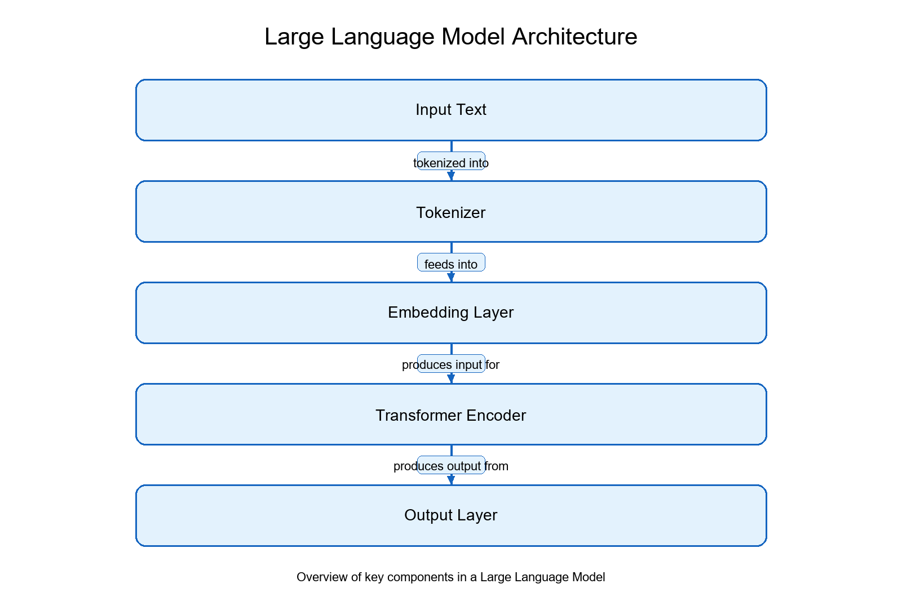
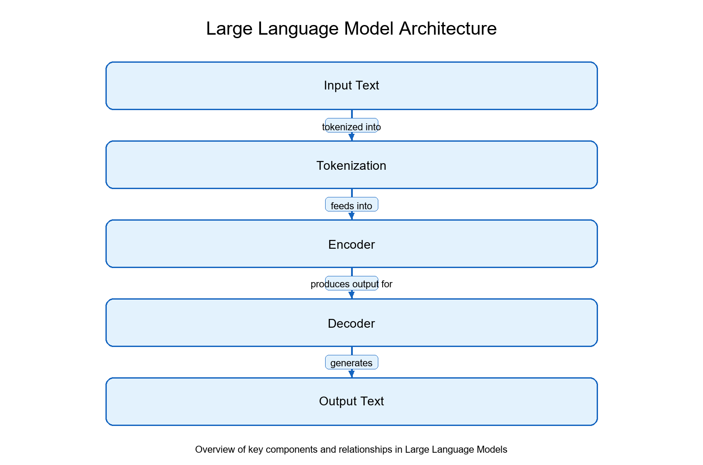
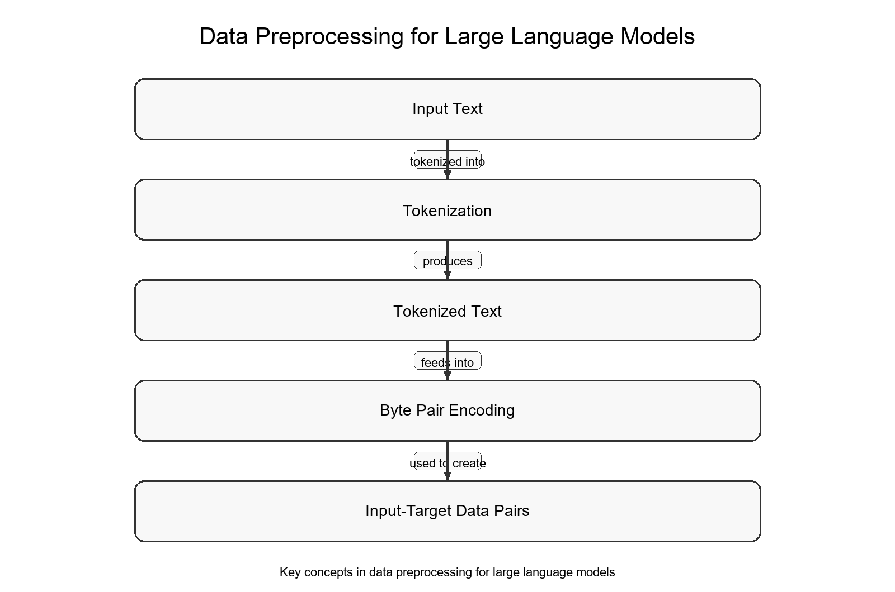
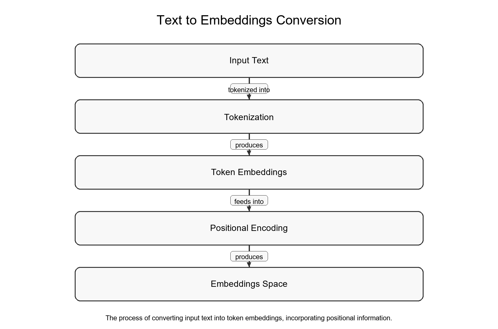
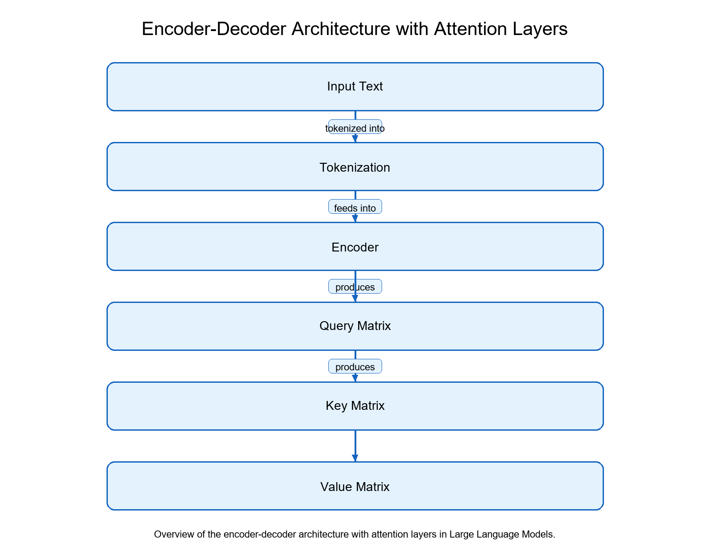
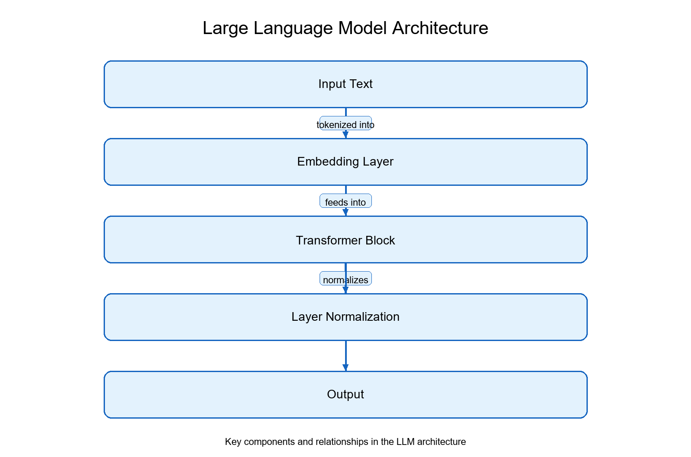
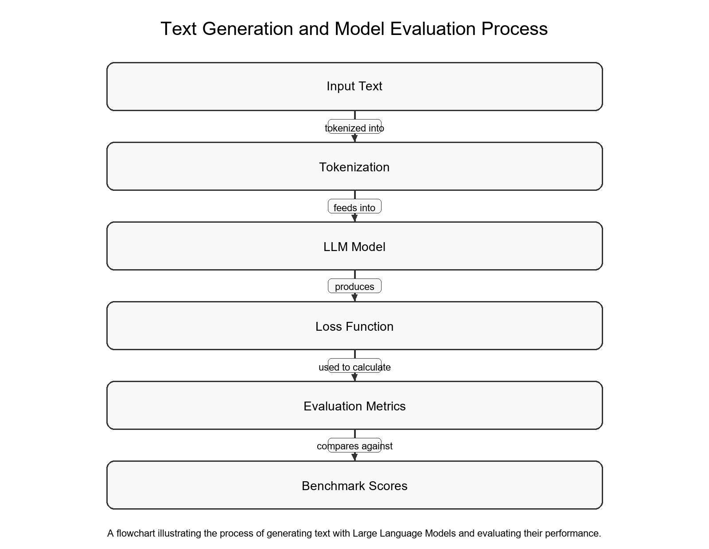
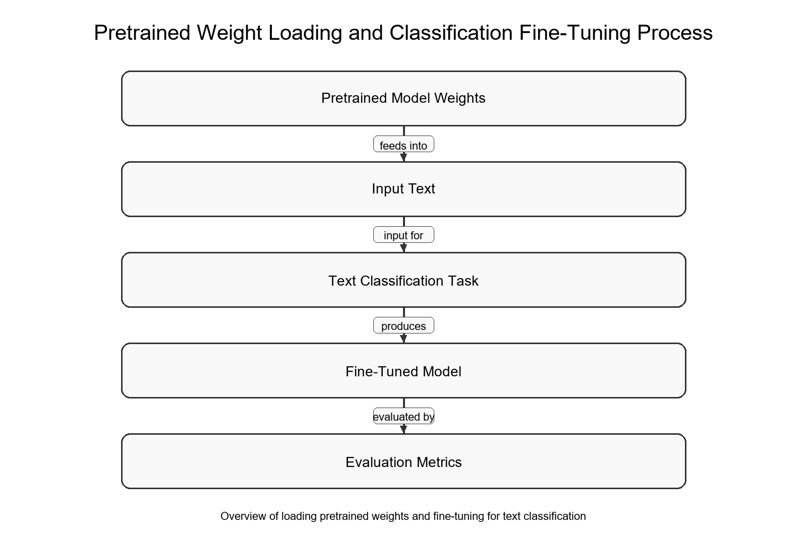
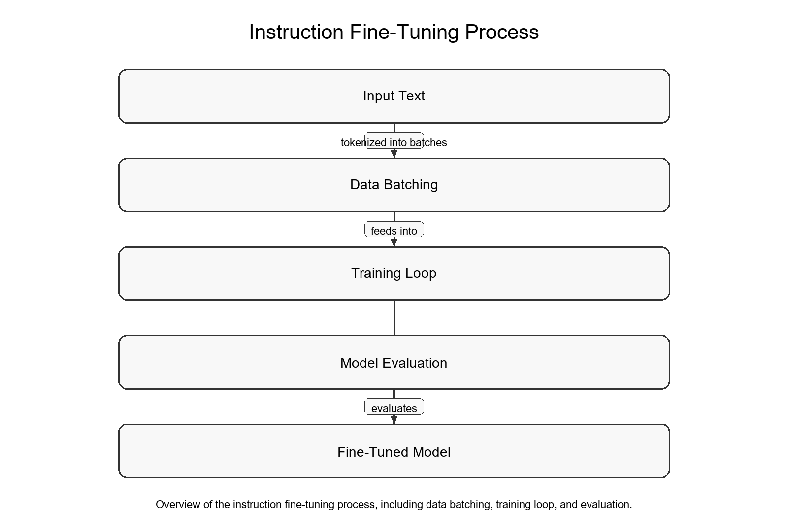

% Building Large Language Models from Scratch
% Generated by LLM Pipeline
% April 2026

\newpage
## Table of Contents

1. Introduction to Building Large Language Models
2. Foundations of Large Language Models
3. Data Preprocessing for Large Language Models
4. Token Embeddings and Positional Encoding
5. Attention Mechanism in Large Language Models
6. Large Language Model Architecture
7. Text Generation and Model Evaluation
8. Loading Pretrained Weights and Classification Fine-Tuning
9. Instruction Fine-Tuning and Advanced Directions

\newpage

\newpage

Chapter 1 provides an introduction to building large language models.

## Understanding the Series Overview

<!-- DIAGRAM_START:chapter_01 -->

*Overview of key components in a Large Language Model*
<!-- DIAGRAM_END:chapter_01 -->

Constructing a large language model from the ground up demands a deep understanding of its underlying components. The series overview offers a comprehensive framework for grasping the intricacies of these models. By concentrating on the fundamental aspects of how large language models operate, rather than relying on pre-built applications, one gains a more profound appreciation of their inner workings.

At its core, a large language model is a complex system that processes and generates human-like language. This system performs a series of intricate steps, including tokenization, embedding, and decoding. Because these processes are often intertwined, they can be viewed as a pipeline, where each step builds upon the previous one.

## Large Language Models Basics

## Pretraining LLMs vs Finetuning LLMs

\newpage

Chapter 2: Foundations of Large Language Models.

## Introduction to Transformers

<!-- DIAGRAM_START:chapter_02 -->

*Overview of key components and relationships in Large Language Models*
<!-- DIAGRAM_END:chapter_02 -->

The Transformer mechanism has been instrumental in advancing a variety of natural language processing tasks. Its architecture, derived from the original Transformer, has enabled numerous applications beyond the initial purpose of machine translation, and the original Transformer was specifically designed to translate English text into multiple languages, including German and French. The Transformer architecture comprises six or eight sequential steps, each serving a specific function, and these steps are indicated by the orange numbers in the schematic. Understanding these steps is essential for grasping the Transformer's operation. The architecture processes input sequences in parallel, allowing efficient and effective handling of large amounts of data. The Transformer's encoder-

## Understanding GPT-3 Architecture

## Stages of Building an LLM from Scratch

Building large language models from scratch proceeds through a series of well‑defined stages that produce sophisticated models capable of understanding and generating human‑like language. The

\newpage

Chapter 3: Data Preprocessing for Large Language Models.

## Tokenization in NLP

## Byte Pair Encoding for Tokenization

<!-- DIAGRAM_START:chapter_03 -->

*Key concepts in data preprocessing for large language models*
<!-- DIAGRAM_END:chapter_03 -->

Tokenization is a critical step in preparing data for large language models because it enables the model to process and understand individual words within a sentence. In its basic form, tokenization involves breaking a sentence into individual words, yet the procedure becomes more complex when applied to large language models. Effective tokenization requires consideration of language nuances such as punctuation, capitalization, and word boundaries. A widely used method for tokenization is Byte Pair Encoding (BPE), which replaces frequent pairs of characters with a single token. This approach allows the model to

## Creating Input-Target Data Pairs

\newpage

Chapter 4 covers token embeddings and positional encoding.

## Understanding Token Embeddings

<!-- DIAGRAM_START:chapter_04 -->

*The process of converting input text into token embeddings, incorporating positional information.*
<!-- DIAGRAM_END:chapter_04 -->

Token embeddings constitute a crucial component of large language models because they allow the model to capture the semantic meaning of individual tokens. Nevertheless, token embeddings have a major limitation: they do not inherently convey positional information. Consequently, tasks that depend on token order—such as understanding the nuances of sentence structure or capturing the context of a particular word—can become difficult. To address this limitation, absolute positional encoding is employed, adding a unique embedding vector to the token embedding for each position in the input sequence. This positional embedding vector is added to the token embedding, thereby modifying the token’s representation according to its position. For example, consider the token sequence “cat,” “sat,” “on,” and “the.” If the token embedding vector for all four tokens is similar, for instance [1, 1, 1], absolute positional encoding would add a distinct positional embedding vector to each token, reflecting its position

## Importance of Positional Embeddings

Positional information is essential for large language models to capture token relationships within a sequence. In the absence of such information, models may

\newpage

Chapter 5 discusses the attention mechanism in large language models.

## Introduction to the Attention Mechanism

## Simplified Attention Mechanism

## Self-Attention Mechanism with Key, Query, and Value Matrices

<!-- DIAGRAM_START:chapter_05 -->

*Overview of the encoder-decoder architecture with attention layers in Large Language Models.*
<!-- DIAGRAM_END:chapter_05 -->

\newpage

Chapter 6 covers Large Language Model Architecture.

## Birds Eye View of the LLM Architecture

## Layer Normalization in the LLM Architecture

<!-- DIAGRAM_START:chapter_06 -->

*Key components and relationships in the LLM architecture*
<!-- DIAGRAM_END:chapter_06 -->

Layer normalization plays a crucial role in the stability and performance of large language models. It normalizes the activations of each layer, which can mitigate the effects of vanishing or exploding gradients during training. In the Transformer block, layer normalization is applied after the feed-forward neural network and is essential for maintaining the stability of the model. From a technical perspective, layer normalization involves subtracting the mean and dividing by the square root of the variance of the input activations. This process centers the activations around zero, which can improve the convergence of the model during training. By normalizing the

## GELU Activation Function

## Shortcut Connections in the LLM Architecture

Shortcut connections in the LLM architecture constitute a crucial component that enables efficient information flow between different layers of the model. This is especially important in large language models, where the depth and complexity of the architecture can cause a significant increase in computational requirements. Introducing shortcut connections allows the model to bypass certain layers and directly access information from earlier layers, thereby reducing the number of computations required.

In technical terms, shortcut connections are a type of residual connection that permits the model to learn the residual function with respect to the input rather than learning the entire function. This is achieved by adding the input to the output of a series of layers, effectively creating a shortcut between the input and the output. The approach has been shown to improve the training speed and accuracy of the

\newpage

Chapter 7, Text Generation and Model Evaluation.

## Generating Text with LLMs

## Measuring LLM Loss Function

## Temperature and Top-K Sampling

<!-- DIAGRAM_START:chapter_07 -->

*A flowchart illustrating the process of generating text with Large Language Models and evaluating their performance.*
<!-- DIAGRAM_END:chapter_07 -->

Temperature scaling and top‑k sampling are two techniques used to control the randomness in generated text. Selecting the token with the highest probability score yields a deterministic choice and consequently a lack of diversity in the generated text. Sampling the next token from a probability distribution introduces a probabilistic element to the generation process. Temperature scaling adjusts the probability distribution to control randomness; a high temperature produces a flatter distribution, whereas a low temperature yields a sharper distribution, thereby permitting more or less randomness in the generated text. In top‑k sampling the model selects the top‑k tokens with the highest probability scores and then samples one of these tokens

## Evaluating LLM Performance

\newpage

Chapter 8, Loading Pretrained Weights and Classification Fine‑Tuning.

## Saving and Loading Model Weights

## Loading OpenAI Pretrained Weights

## Fine-Tuning for Text Classification

## Building a Spam Classifier

## Evaluating the Classification Model

<!-- DIAGRAM_START:chapter_08 -->

*Overview of loading pretrained weights and fine-tuning for text classification*
<!-- DIAGRAM_END:chapter_08 -->

The performance of the classification model is a critical aspect of fine‑tuning a pre‑trained language model, and a well‑performing model is essential for accurately classifying new emails as spam or not spam. Evaluation relies on metrics such as accuracy, precision, recall, and F1‑score, which provide quantitative measures of performance and help identify areas for improvement. In the email classification task, the output of the pre‑trained model can be used to compute accuracy; for instance, if the model correctly classifies 90 % of the test emails as spam or not spam, its accuracy can be reported as 90 %. This information can guide adjustments to the fine‑tuning process and enhance model performance. A high‑performing classification model enables informed decisions about email

\newpage

Chapter 9 is titled Instruction Fine‑Tuning and Advanced Directions.

## Introduction to Instruction Fine-Tuning

## Data Batching and Dataloaders

<!-- DIAGRAM_START:chapter_09 -->

*Overview of the instruction fine-tuning process, including data batching, training loop, and evaluation.*
<!-- DIAGRAM_END:chapter_09 -->

Data batching is a crucial step in the fine‑tuning process of large language models. It consists of dividing the dataset into smaller, manageable chunks, called batches, to enable efficient processing and training. This is especially important when the dataset is large, because it allows the model to handle a substantial amount of data without overwhelming the system. In technical terms, data batching creates a batch of input sequences together with their corresponding output labels for feeding into the model during training. Typically, the batch is formed by grouping a fixed number of input‑output pairs, such as three data samples as illustrated in

## Instruction Fine-Tuning Training Loop

## Evaluating the Fine-Tuned Model

## Future Directions and Next Steps

